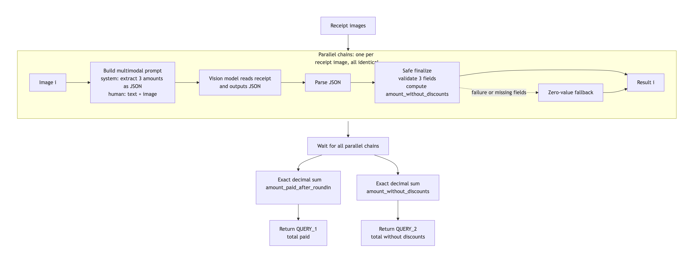

# FTEC5660 Homework 1: Receipt Chain

Build a LangChain pipeline that reads every supermarket receipt in a folder
with the vision-capable DeepSeek Flash model and answers these two questions:

1. How much money did I spend in total for these bills?
2. How much would I have had to pay without the discount?

For this homework, **amount spent** means the final payment after the receipt's
rounding line. **Without the discount** means the sum of the original positive
item prices: add back every promotion, coupon, member, app, packaging-damage,
and percentage discount, but do not add back rounding.

## Student task

Only edit the two functions in `hw1.py` that contain `### YOUR CODE HERE`:

- `build_chain()` creates your LangChain chain.
- `answer_queries()` runs the chain on the receipt images and returns one final
  response for each question.

You may use prompt chaining, routing, parallel calls, reflection, or a
combination. Your final responses should each contain one HKD amount. Do not
hard-code filenames or public answers; grading uses unseen receipt folders.

## Setup and public test

```bash
python3 -m venv .venv
source .venv/bin/activate
pip install -r requirements.txt
```

Put your DeepSeek key after `DEEPSEEK_API_KEY=` in `.env`, then run:

```bash
python3 hw1.py --image-folder public_test
```

The program creates `results.csv` in the current directory. Its columns are
`query`, `model_response`, and `correctness`. The public answers are in
`public_test/ground_truth.json`. The starter intentionally returns the dummy
response `please design your chain to answer these two queries.` so it runs
before you add any API code.

The required model is `deepseek-v4-flash-vision-exp`, the vision-capable
DeepSeek Flash model. JPEG, PNG, GIF, and WebP inputs are accepted by the
homework runner.


## Homework 1 solution



### Solution description

This solution is designed as “one independent parallel chain per receipt image” because different receipts have no dependencies on one another and can be processed simultaneously, reducing the total time spent waiting for the model to read each image one by one. At the same time, if one chain fails, it will not block the other receipts, so the whole batch can still complete.

Within each chain, a multimodal prompt is first constructed, combining strict extraction instructions with the receipt image and passing them to the vision model. The purpose is to let the model both see the image and be explicitly constrained to output only a JSON object containing three amounts, reducing format drift and irrelevant content. The model is responsible only for visual extraction, not arithmetic, because large models are unreliable at numerical computation.

The program then parses the JSON and performs safe finalization: it validates the three fields, computes `amount_without_discounts = subtotal_after_discounts_before_rounding + discount_total`, and falls back to zero values if parsing fails or fields are missing. The reason for this design is to separate “reading the image” from “calculation/validation,” letting deterministic code handle amount derivation and fault tolerance, so that a single bad image or abnormal output does not crash the entire program.

After all parallel chains finish, the program uses exact `Decimal` arithmetic to sum the amount paid and the amount without discounts separately, rather than letting the LLM perform addition, because financial amounts cannot tolerate floating-point errors. Finally, it returns the two totals required by the queries.

